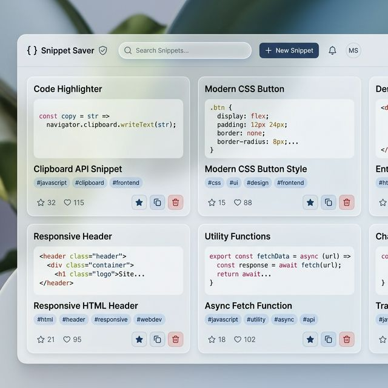

# ✦ Snippet Saver (SnippetCV)

[](https://nodejs.org/)
[](https://www.mongodb.com/)
[](LICENSE)

**Snippet Saver** is a premium, minimal, and lightning-fast full-stack application designed to help developers organize their digital life. Whether it's code snippets, frequently used links, or quick documentation notes, Snippet Saver provides a beautiful interface to save, search, and manage them with ease.



---

## ✨ Key Features

- **💾 Instant Saving** — Quickly save code snippets with titles and categorized tags.
- **🔍 Real-time Search** — Deep-search through your collection by title or tag with zero lag.
- **🏷 Smart Tagging** — Clickable, color-coded tags for effortless organization and filtering.
- **★ Favorites System** — Star your most important snippets for quick access in the favorites view.
- **⧉ One-Click Copy** — Integrated clipboard support with visual toast notifications.
- **🎨 Syntax Highlighting** — Beautiful code rendering powered by `highlight.js`.
- **📱 Fully Responsive** — Seamless experience across mobile, tablet, and desktop devices.
- **🌙 Premium UI** — A modern, light-themed interface with subtle glassmorphism and smooth animations.

---

## 🛠 Tech Stack

| Layer | Technologies |
| :--- | :--- |
| **Frontend** | Vanilla JS (ES6+), HTML5, CSS3 (Modern Variables & Flex/Grid) |
| **Backend** | Node.js, Express.js |
| **Database** | MongoDB, Mongoose (ODM) |
| **Utilities** | highlight.js (Syntax), Lucide-like icons, Google Fonts (Inter & JetBrains Mono) |

---

## 📂 Project Structure

```text
SnippetCV/
├── backend/
│   ├── models/Snippet.js       # Mongoose Schema & Validation
│   ├── routes/snippets.js      # RESTful API Endpoints
│   ├── server.js               # Express Server Initialization
│   ├── .env                    # Environment Configuration
│   └── package.json            # Backend Dependencies
└── frontend/
    ├── index.html              # Main UI Structure
    ├── style.css               # Modern Design System & Layout
    ├── script.js               # Frontend Logic & API Integration
    └── preview.png             # UI Screenshot
```

---

## 🚀 Getting Started

### 1. Prerequisites
- **Node.js** (v18 or higher)
- **MongoDB** (Local instance or Atlas URI)

### 2. Environment Setup
Navigate to the `backend` folder and create a `.env` file:
```bash
PORT=5000
MONGO_URI=mongodb://127.0.0.1:27017/snippetsaver
```

### 3. Installation & Run
Start both the backend and the frontend:

**Backend:**
```bash
cd backend
npm install
npm run dev
```

**Frontend:**
Simply open `frontend/index.html` in your browser or use a live server:
```bash
npx serve frontend
```

---

## 📡 API Reference

| Method | Endpoint | Description |
| :--- | :--- | :--- |
| `GET` | `/snippets` | Retrieve all snippets (sorted by newest) |
| `POST` | `/snippets` | Create a new snippet card |
| `GET` | `/snippets/search?q=...` | Search snippets by title or tags |
| `PATCH` | `/snippets/:id/favorite` | Toggle the "favorite" star status |
| `DELETE` | `/snippets/:id` | Permanently delete a snippet |

---

## 📝 Future Enhancements
- [ ] Dark Mode toggle support
- [ ] User authentication and cloud sync
- [ ] Multi-language syntax selection
- [ ] Folders/Collections for deeper organization

---

## 📄 License
This project is licensed under the MIT License - see the LICENSE file for details.

---

<p align="center">Made with ❤️ for developers who love clean code.</p>
